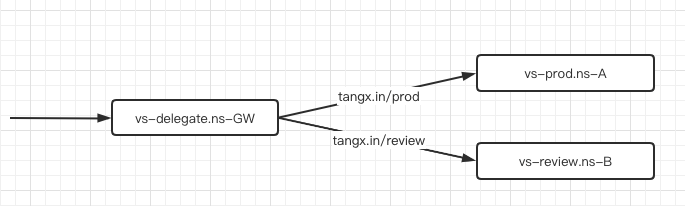
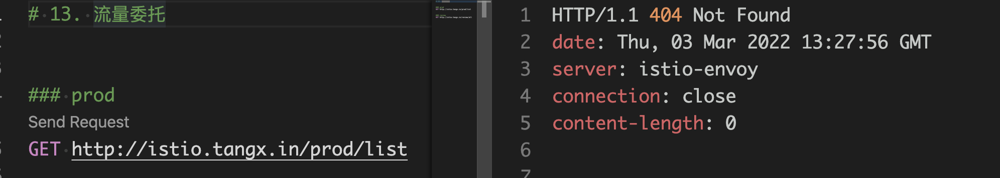

# VirtualService 服务委托

服务委托就是流量转发。 

> https://istio.io/latest/docs/reference/config/networking/virtual-service/#Delegate




如下 VirtualService 的 **流量委托** 定义， 是在 `myistio` 这个命名空间中创建的。 但是将 `myistio.tangx.in/prod` 的流量转发到了命名空间 `myistio-prod` 中的 `prod` 服务中； 同样将 `myistio.tangx.in/reviews` 的流量转发到了命名空间 `myistio-review` 中的 `review` 服务中。

```yaml
# vs http delegate
apiVersion: networking.istio.io/v1alpha3
kind: VirtualService
metadata:
  name: vs-delegate
  namespace: myistio # 注意 namespace
spec:
  gateways:
    - istio-tangx-in
  hosts:
    - istio.tangx.in
  http:
    - match:
        - uri:
            prefix: "/prod"
      delegate:
        name: vs-prod   # vs name
        namespace: myistio-prod
    - match:
        - uri:
            prefix: "/review"
      delegate:
        name: vs-review  # vs name
        namespace: myistio-review
```

需要注意 **被委托对象** 必须是 VirtualService 对象， 例如 `myistio-prod` 命名空间中的 `vs-prod` 对象

```yaml
---
# vs prod
apiVersion: networking.istio.io/v1alpha3
kind: VirtualService
metadata:
  name: vs-prod
  namespace: myistio-prod # 注意 namespace
spec:
  # hosts:                  # 这里不能设置 hosts， 即使是对外暴露的相同域名也不行,
                            # 否则可能出现 404 
  #   - myistio.tangx.in
  http:
    - route:
        - destination:
            host: svc-prod
```

同样需要 **注意** 在定义 **被委托对象(`vs-prod`)** 时， 不能指定 `.spec.hosts` 的值， 否则流量转发异常， 可能出现 404。




如果熟悉 nginx 的话， 可能会很好理解

```ini
# nginx.conf
server {

    listen 80;
    server_name tangx.in;

    location ~ /prod {
        proxy_pass http://vs-prod.myistio-prod:80/
    }

    location ~ /review {
        proxy_pass http://vs-review.myistio-review:80/
    }
}

```

