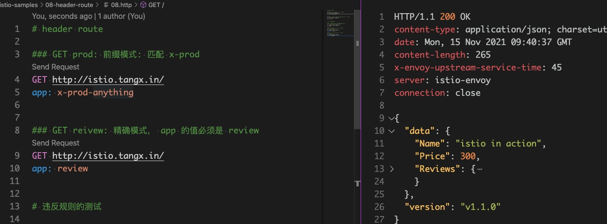

# VirtualService 使用 header 重写路由

在 istio 中， 除了 path 之外还可以使用 **Header** 进行路由规则管理。

为了更好的展示 header 路由效果， 这里配合使用了 **uri 的精确匹配模式**。 实现之后， 只能访问地址 `http://istio.tangx.in/` ， 其他均为 404。 具体哪个服务应答， 完全根据 header 匹配选择。

效果如下:



使用 Header 匹配有几个必要条件

1. Header 的 **key** 只能包含 **小写字母** 和 **连字符 `-`**。
    + 从实际测试中来看。 这个规则只是一个 **建议**。 使用 **驼峰(SrvReview)** 时依旧可以转发。
2. Header 的 **value** 大小写敏感。
3. 如果 Header 的值为 **空**， 则只检测 key 是否存在。 
    + 将 key 的匹配 **值** 设置为 **空**。 `prefix, exact, regex` 模式均可。

> https://istio.io/latest/docs/reference/config/networking/virtual-service/#HTTPMatchRequest


## 匹配模式

与之前的 **路径匹配** 相似，  header 匹配也具有三种模式。

1. prefix: 前缀模式
2. exact: 精确模式
3. regex: 正则模式


### 1. 前缀模式

header 的 key 相同， value 从零开始相同。 与正则规则 `^value.*` 等价

请求方式如下

```bash
### GET prod: 前缀模式: 匹配 x-prod
GET http://istio.tangx.in/
app: x-prod-anything
```

VirtualService 配置如下

```yaml
---
apiVersion: networking.istio.io/v1alpha3
kind: VirtualService
metadata:
  name: vs-header-route
  namespace: myistio
spec:
  gateways: # 选择 gateway
    - istio-tangx-in
  hosts:
    - istio.tangx.in
  http:
  - name: "prod-route"
    match:
    - headers:
        app:
          prefix: x-prod  # 使用 前缀模式
      uri:                # 为了更好的展示 header 路由。 这里配合 uri 的精确匹配模式
        exact: /
    rewrite:
      uri: /prod/list
    route:
    - destination:
        host: svc-prod

```


### 2. 精确模式

header 的 key,value 必须完全匹配规则。

请求方式如下

```bash
### GET reivew: 精确模式， app 的值必须是 review
GET http://istio.tangx.in/
app: review
```

VirtualService 规则如下

```yaml
---
apiVersion: networking.istio.io/v1alpha3
kind: VirtualService
metadata:
  name: vs-header-route
  namespace: myistio
spec:
  gateways: # 选择 gateway
    - istio-tangx-in
  hosts:
    - istio.tangx.in
  http:
  - name: "review-route"
    match:
    - headers:
        app:
          exact: review   # 使用精确模式
      uri:
        exact: /
    rewrite:
      uri: /review/all
    route:
    - destination:
        host: svc-review
```

### 3. 正则模式

略


## 只检测 key 不检测 value

将任意匹配规则 `prefix / exact / regex` 的匹配值结果设置为 **空**。

```yaml
## 省略
  # If the value is empty and only the name of header is specfied, presence of the header is checked.
  - name: "key without value"
    match:
    - headers:
        onlykey:
          prefix: ""   # 有 key 没有 value
        #   exact: ""   # 有 key 没有 value
        #   regex: ""   # 有 key 没有 value
      uri:
        exact: /
    rewrite:
      uri: /review/all
    route:
    - destination:
        host: svc-review
```

## 一些违反规范规则的测试


```yaml
# https://istio.io/latest/docs/reference/config/networking/virtual-service/#HTTPMatchRequest

---
apiVersion: networking.istio.io/v1alpha3
kind: VirtualService
metadata:
  name: vs-header-route
  namespace: myistio
spec:
  gateways: # 选择 gateway
    - istio-tangx-in
  hosts:
    - istio.tangx.in
  http:

## 一些违反规则的测试 ###
  # The keys uri, scheme, method, and authority will be ignored.
  # 其实不会被忽略
  - name: "key (uri) in header"
    match:
    - headers:
        uri:    
          exact: "app"
      uri:
        exact: /
    rewrite:
      uri: /review/all
    route:
    - destination:
        host: svc-review

  # The header keys must be lowercase and use hyphen as the separator, e.g. x-request-id.
  # 其实可以为大写
  - name: "uppercase in keys"
    match:
    - headers:
        SrvReview:    
          exact: "review"
      uri:
        exact: /
    rewrite:
      uri: /review/all
    route:
    - destination:
        host: svc-review

```

测试结果

```bash
# 违反规则的测试

#### 1. header key 出现关键字将被忽略
#  > 关键字出现， 不会被忽略
GET http://istio.tangx.in/
uri: app

#### 2. header key 只能是 `小写字母` 和 `-`
#  > 可以为大写
GET http://istio.tangx.in/
SrvReview: review

```