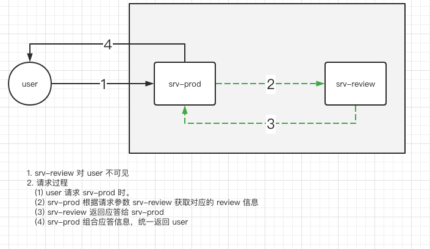

# VirtualService 混沌测试/错误注入

在 Istio 中还实现了一个很重要的功能: **错误注入**。 可以设置 **一定几率** 出现 **延迟(delay)** 和 **中止(abort)** 错误。

## Http Fault Injection Delay 延迟

一定概率出现 **缓慢** 相应。

1. `fixedDelay`: 延迟时间。 格式 **1h / 1m / 1s**。 最小 1ms。 
2. `percentage`: 错误触发几率。 0-100 之间。 可以为 double 类型的小数。


```yaml
---
# fault injection
apiVersion: networking.istio.io/v1alpha3
kind: VirtualService
metadata:
  name: review-fault-injection
spec:
  hosts:
    - svc-review
  http:
    - match:
      route:
        - destination:
            host: svc-review
      fault:
        delay:
          percentage:
            value: 50
          fixedDelay: 5s
```


## Http Fault Injection Abort 中止

一定概率出现 **中止** 相应， 并返回错误响应 http code

1. `httpStatus`: 错误响应 http code。
2. `percentage`: 错误触发几率。 0-100 之间。 可以为 double 类型的小数。


```yaml
---
# fault injection
apiVersion: networking.istio.io/v1alpha3
kind: VirtualService
metadata:
  name: review-fault-injection
spec:
  hosts:
    - svc-review
  http:
    - match:
      route:
        - destination:
            host: svc-review
      fault:
        abort:
          percentage:
            value: 50
          httpStatus: 400
```


## 案例

在本案例中

1. srv-review 对 user 不可见
2. 请求过程
    + (1) user 请求 srv-prod 时。  
    + (2) srv-prod 根据请求参数 srv-review 获取对应的 review 信息 
    + (3) srv-review 返回应答给 srv-prod 
    + (4) srv-prod 组合应答信息，统一返回 user



除了上述提到的 srv-review 的错误注入。

还在 prod 的 VirtualService 上使用了 timeout 参数， 当总请求超过 3秒 的时候， 将会出现 **request timeout** 错误； 如果不加此参数，会在 **延迟5秒** 后得到正确相应结果。

```yaml
# normal prod
apiVersion: networking.istio.io/v1alpha3
kind: VirtualService
metadata:
  name: vs-prod
spec:
  gateways:
    - istio-tangx-in
  hosts:
    - svc-prod
    - istio.tangx.in
  
  http:
    - match:
      route:
        - destination:
            host: svc-prod
      timeout: 3s
```

测试请求与结果如下。

```bash
# 正常请求
time curl http://istio.tangx.in/prod/list

    {"data":{"Name":"istio in action","Price":300,"Reviews":{"1":{"id":"1","name":"zhangsan","commment":"istio 功能很强大， 就是配置太麻烦"},"2":{"id":"1","name":"wangwu","commment":"《istio in action》 真是一本了不起的书"}}},"version":"v1.1.0"}

    real    0m0.011s
    user    0m0.004s
    sys     0m0.005s

# 延迟5秒。 3秒请求超时
time curl http://istio.tangx.in/prod/list

    upstream request timeout

    real    0m3.014s
    user    0m0.004s
    sys     0m0.005s

# 相应中止
time curl http://istio.tangx.in/prod/list

    {"error":"Error: svc-review request abort. resp code is 400, failed","message":"获取评论失败， 内部错误"}

    real	0m0.011s
    user	0m0.005s
    sys	0m0.004s
```