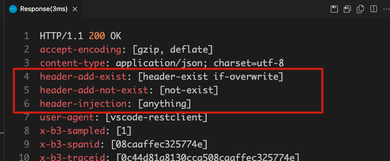

# VirtualService Header 操作

当 Envoy 在进行请求流量转发的时候， 还可以对消息 `(request/response)` 的 Header 进行操作。

1. `set` : 如果不存在， 则 **创建** header， 如果存在， 则 **覆盖**  header

```yaml
spec:
  http:
  - headers:
      request:
        set:
          key1: value1
          key2: value2
```

2. `add` : 如果不存在， 则 **新增**； 如果村子啊， 则 **追加** 

```yaml
spec:
  http:
  - headers:
      request:
        add:
          key1: value1
          key2: value2
```

3. `remove`: 如果存在， 则 **删除** header; 不存在, 则 **忽略**

```yaml
spec:
  http:
  - headers:
      request:
        remove:
          - key1
          - key2
```


## 测试用例

创建 vs-review 配置如下， 对 header reqeust **更新/追加/删除** 进行操作。

```yaml
---
# vs review
apiVersion: networking.istio.io/v1alpha3
kind: VirtualService
metadata:
  name: vs-review
  namespace: myistio # 注意 namespace
spec:
  gateways:
    - istio-tangx-in
  hosts:
    - istio.tangx.in
    - svc-review
  http:
    # header 操作
    - name: "header-operation"
      headers:            # request header 操作与 route 在一层
        request:
          set:  # 更新
            header-injection: "anything"
          add:  # 追加
            header-add-not-exist: "not-exist"
            header-add-exist: "if-overwrite"
          remove:  # 删除
            - header-should-remove
            - "header-should-remove2"
```

更新 review， 向 response 中添加所有 request 的 header

```go
// 展示 header
func headerHanlder(c *gin.Context) {

// response 中写入 request header
	for key, value := range c.Request.Header {
		c.Header(key, fmt.Sprintf("%s", value))
	}

// 判断 header 是否注入成功
	headerInjection := c.GetHeader("header-injection")
	if headerInjection != "" {
		c.Header("remove-header", "this remove-header is invisible")
		c.JSON(http.StatusOK, gin.H{
			"code":    "success",
			"message": "header 注入成功",
			"header":  fmt.Sprintf("header-injection value is = %s", headerInjection),
		})

		return
	}

// 默认注入失败
	c.JSON(http.StatusBadRequest, gin.H{
		"code":    "failed",
		"message": "header 注入失败",
	})s
}
```

向 review 发送请求， 可以看到所有 header

```yaml
###  header operation
GET http://istio.tangx.in/header/review/header
# anything, 被 envoy 覆盖
header-injection: user-request
# header-exist if-overwrite, 被 envoy 追加
header-add-exist: header-exist
# 不存在， 被 envoy 删除
header-should-remove: anything 
```



